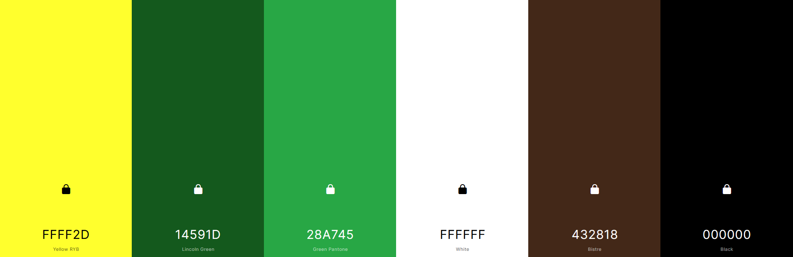
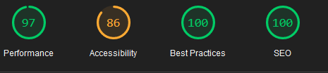

# DINOTOPIA


[Here is a link to the live final project](https://dinotopia.herokuapp.com/)

## INITIAL IDEA
My initial idea behind Dinotopia is to make a eCommerce site about Dinosaurs, where anyone will be able to purchase their own
Dinosaur, including eggs, young dinosaurs, adult dinosaurs, old dinosaurs and fossils. The site is being designed to be responsive
for mobile, tablet, and desktop devices. The user will be able to navigate easily throughout the site, and the site will be fully accessible for all users.

## FINAL DESIGN


## CONTENTS

* [User Experience](#user-experience)  
  * [User Stories](#user-stories)

* [Design](#design)
  * [Fonts](#fonts)
  * [Color Scheme](#color-scheme)
  * [Wireframes](#wireframes)

* [Features](#features)
  * [Features Implemented](#features-implemented)
  * [Future Implementations](#future-implementations)

* [Database](#database)
  * [Database Schema](#database-schema)

* [Technologies](#technologies)
  * [Languages](#languages)
  * [Frameworks and Libraries](#frameworks-and-libraries)
  * [Programs](#programs)

* [Deployment](#deployment)
  * [Initial Deployment](#initial-deployment)
  * [How To Fork A Repository](#how-to-fork-a-repository)
  * [How To Clone A Repository](#how-to-clone-a-repository)
  * [How To Make A Local Clone](#how-to-make-a-local-clone)

* [Testing](#testing)
  * [Code Validators](#code-validators)

* [Content](#content)
  * [Images](#images)
  * [Text Content](#text-content)

* [Acknowledgements](#acknowledgements)

[Back To Top](#dinotopia)

## USER EXPERIENCE

### USER STORIES

The structure of the site is designed to be simple and easy to use. It has a good balance of images and content, so 
it does not overload the user, while allowing the user to have all the information they require to make a purchase,
and doesn't leave the user needing more information to carry out all steps needed on the site.

* The website is for the following user types:
  * Users who are curious at looking at Dinosaurs
  * Users who are browsing to look for their first purchase.
  * Users who are going to make their next purchase and increase their personal collection.
  * Users who are browsing to purchase something as a gift.
  * Users who are looking to make a bulk purchases if they require.

#### CLIENT GOALS

* The site needs to be easily accesible.
* The navigation menu needs to be simple to use on a range of devices, including desktop, tablet and mobile.
* Manoeuvering around the site should be simple and straightforward.
* To be able to create an user account.
* It should be easy to register, login and logout.
* The site should be informative and all the text should be easy to read.
* The images should be clear, not stretched and/or squashed.

#### FIRST TIME VISITORS

* I want the site to be easy to understand
* I want the user how to navigate throughout the site easily.
* I want the user to be able to create an account easily.
* I want the content to be easily read and understandable.
* I want the checkout process to be straightforward and easy to understand.
* I want images to be clearly visible.

#### RETURNING USER

* To be able to login.
* To be able to view previous orders.
* To be able to Create, Read, Update and Delete blogs.
* To Recommend the site to friends and family.
* To make new purchases with saved details.

#### ADMIN USER

* I want the admin to be able to create an account.
* I want the admin to be able to add a product.
* I want the admin to be able to edit a product.
* I want the admin to be able to delete a product.

[Back To Top](#dinotopia)

## DESIGN

### FONTS

I chose two fonts to use on my site to make my site title and my navigation menu stand out from the rest of the site.

I chose `lobster` font style for the main page title to stand out but have a modern twist to it, while using `permanent marker` font style make the navigation menu have a older style look.

### COLOR THEME

These colors were chosen to connect to a jungle theme. The green has been used to resemble leaves, and the brown resembles the tree trunks and/or ground. This relates to the way that the Dinosaurs lived in the wild. 

Black was used for form borders, also in the case the background image fails to load correctly, Lastly the `#28A745` shade of green was used for the hover affect, while the white was chosen as to make the content stand out and be easily readable, ensuring full AAA WCAG colour contrast compliance.

Lastly using the yellow color so the user knows what they are hovering over while traversing the site.



### WIREFRAMES

Wireframes were created using [Balsamiq](https://balsamiq.com/) and exported into a pdf format, which can be viewed [here](static/docs/wireframes/MS4-wireframes.pdf)

[Back To Top](#dinotopia)

## FEATURES

### FEATURES IMPLEMENTED

I have used the following features in this project:

* Changing navigation
* Dinosaur search bar
* Add products to site
* Edit and Delete products already on site
* Add, Edit and Delete blog post to site
* Edit and Delete blog post already on site
* Delete modal to prevent accidental deletion

### FUTURE IMPLEMENTATIONS

* Pagination
* Star rating

[Back To Top](#dinotopia)

## DATABASE

### DATABASE SCHEMA

Database schema were created using [Lucid Chart](https://lucid.co/?gclid=CjwKCAiAzrWOBhBjEiwAq85QZ_xqCMuCxDBFQ8nYCYusbaLl5e8E1E2Ny0sW8Wl7CEZRYSDvAcEE1hoCMHMQAvD_BwE&km_CPC_AdGroupID=55688909257&km_CPC_AdPosition=&km_CPC_CampaignId=1490375427&km_CPC_Country=9045962&km_CPC_Creative=442433236001&km_CPC_Device=c&km_CPC_ExtensionID=&km_CPC_Keyword=lucidchart&km_CPC_MatchType=e&km_CPC_Network=g&km_CPC_TargetID=aud-921551091782%3Akwd-33511936169&km_CPC_placement=&km_CPC_target=&utm_campaign=_chart_en_tier1_mixed_search_brand_exact_&utm_medium=cpc&utm_source=google&_gl=1*1x1hjt1*_gcl_aw*R0NMLjE2NDA4NzczMDEuQ2p3S0NBaUF6cldPQmhCakVpd0FxODVRWl94cUNNdUN4REJGUThuWUNZdXNiYUxsNWU4RTFFMk55MHNXOFdsN0NFWlJZU0R2QWNFRTFob0NNSE1RQXZEX0J3RQ..) and exported into a pdf format, which can be viewed [here](static/docs/database-schema/MS4-Project-schema.pdf)

## TECHNOLOGIES

### LANGUAGES

    

## FRAMEWORKS AND LIBRARIES
 

### PROGRAMS


[Git](https://git-scm.com/) was used for version control by using the Gitpod terminal to add and commit to Git and push to Github.


[GitHub](https://github.com/) was used to store all the code for this project after being pushed from GitPod, which I also used a Project board to 
keep track of the project development by splitting tasks into smaller and more managable sections.


[Heroku](https://id.heroku.com) was used for deployment of the live site.


[AWS](https://aws.amazon.com/) was used for storing static files and media images for this project.


[Firefox Developer](https://www.mozilla.org/en-GB/firefox/developer/) Tools was used for troubleshooting and trying new visual changes without it affecting the current code.

### Other

#### GitPod

[GitPod](https://gitpod.io) was used as an IDE whilst coding this site.

#### Favicon

[Favicon](https://favicon.io/) was used to create a favicon image that was added to the website.

#### Google Fonts

[Google Fonts](https://fonts.google.com/) was used for all the text content on the site pages.

#### Coolors

[Coolors](https://coolors.co/) was used to choose the colour theme of this project, while ensuring full AAA WCAG colour contrast compliance.

#### Am i Responsive

[Am i Responsive](http://ami.responsivedesign.is/) was used to create the image in my [Final Design](#final-design) section.

[Back To Top](#dinotopia)

## SOLVED BUGS

1. During the development process a bug was found causing my dropdown menu button on mobile and tablet devices to stop working, when initially the dropdown button was working.

After closer inspection on this issue, it turned out that I had changed and imported the wrong script tag, which was rectified by changing the script to the one below.


2. While working on my order successful functionality, I came across the error below after filling in the order form and pressing the complete order button.


After looking at the error closely, I connected the numbers that were provided on the error screen with the `max_digits` values that I had in the `lineitem_total` inside the `OrderLineItem` class in the `models.py` file.


From the image above, I made two changes, my first change was `max_digit=6` to `max_digit=10` and my second change was `decimal_places=2` to `decimal_places=4`, after making these changes, it solved my issue.

3. During the production stage of the site, I found an error where I was unable to complete a payment transaction as shown in the image below.


After some investigating into this error, while using the terminal as a debugger, I noticed that there was a missing single quote from the metadata stripe payment intent.


Upon inserting the single quote at the end of `save_info` inside the parentheses, I rechecked for any further issues in the code, which none was found.


As a result, I was able to make and complete a payment transaction once again.


[Back To Top](#dinotopia)

4. While a fellow student was looking through my project, they made a test purchase. At this point they advised me that they did had no received a order confirmation email.

After thoroughly looking at all the files in my project to see where the error could be coming from, Also watching the email videos from the boutique ado project once again to verify the steps were done correctly, I was unable to find any issues.

Which at this point, I looked for help from tutor support, I advised that my account registration emails were working but not the order confirmation. which at this point Ed from tutor support had a look at my workspace and advised me that my `checkout/wh` path was not being accessed, which was why the order confirmation emails was not working as per the image below.


At this point, Ed and I went on to checking the webhook endpoints on heroku and if everything was in order. After doing a few other checking on signing secret and if all variables matched on heroku site and the gitpod variables also.

After making this checks, Ed advised me that it would be best to start from scratch and delete current webhooks end points and create new ones. After doing so and updating variables in heroku, I restarted my workspace and Ed at this point done the following command `echo $STRIPE_WH_SECRET` in the gitpod terminal as shown in the image below.


This is when I noticed that the `STRIPE_WH_SECRET` variable did not match the one that was created, which is when I realised that I did not update the `STRIPE_WH_SECRET` in the gitpod settings. After updating the gitpod `STRIPE_WH_SECRET` variable and restarting the workspace, I was giving a error saying `original_bag not defined`.

After changing `original_bag=original_bag` to `original_bag=bag`, I was given another error advising me that `checkout/wh/` was looking for a template but couldn't find it as showing in the image below.


Which at this point, by having a closer look at the format of the folders in my repo, I had noticed that the emails folder was in the incorrect location. Ed advised me that the correct format for the folder was `checkout > templates > checkout > confirmation emails`, upon moving the folder into the correct location and making another test purchase, I was able to get a order confirmation email print out in the terminal as shown below.


Due to being able to get my order confirmation working locally, the next step was to create a new webhook end point for the deployed live site and the email would be working, which was confirmed by making a purchase on the deployed site.

## TESTING

### CODE VALIDATORS

W3C Markup Validator and W3C CSS Validator was used to validate my project to make sure there were no errors within the site.

* W3C HTML Validator Results

All the links below have shown to have had no errors.

* [Home Page](https://validator.w3.org/nu/?doc=https://dinotopia.herokuapp.com/)
* [Product Details Page](https://validator.w3.org/nu/?doc=https://dinotopia.herokuapp.com/products/10/)
* [Dinosaur Eggs Page (sorted by price, ascending order)](https://validator.w3.org/nu/?doc=https://dinotopia.herokuapp.com/products/?category=dinosaur_eggs,sort=price&direction=asc)
* [Dinosaur Eggs Page (sorted by category)](https://validator.w3.org/nu/?doc=https://dinotopia.herokuapp.com/products/?category=dinosaur_eggs)
* [Dinosaur Eggs Page (sorted by price, ascending order)](https://validator.w3.org/nu/?doc=https://dinotopia.herokuapp.com/products/?category=dinosaur_eggs,sort=price&direction=asc)
* [Dinosaur Eggs Page (sorted by category)](https://validator.w3.org/nu/?doc=https://dinotopia.herokuapp.com/products/?category=dinosaur_eggs)
* [Fossil Page (sorted by price, ascending order)](https://validator.w3.org/nu/?doc=https://dinotopia.herokuapp.com/products/?category=dinosaur_fossils,sort=price&direction=asc)
* [Fossil Page (sorted by category)](https://validator.w3.org/nu/?doc=https://dinotopia.herokuapp.com/products/?category=dinosaur_fossils)
* [Blog Home Page](https://validator.w3.org/nu/?doc=https://dinotopia.herokuapp.com/blog/)
* [Add New Blog Page](https://validator.w3.org/nu/?doc=https://dinotopia.herokuapp.com/blog/add_post/)
* [Edit Blog Page](https://validator.w3.org/nu/?doc=https%3A%2F%2Fdinotopia.herokuapp.com%2Fblog%2Fedit%2Fmanni8436-test%2F)
* [Add New Product Page](https://validator.w3.org/nu/?doc=https%3A%2F%2Fdinotopia.herokuapp.com%2Fproducts%2Fadd%2F)
* [Edit Product Page](https://validator.w3.org/nu/?doc=https%3A%2F%2Fdinotopia.herokuapp.com%2Fproducts%2Fedit%2F4%2F)
* [Profile Page](https://validator.w3.org/nu/?doc=https%3A%2F%2Fdinotopia.herokuapp.com%2Fprofile%2F)
* [Order History Page](https://validator.w3.org/nu/?doc=https%3A%2F%2Fdinotopia.herokuapp.com%2Fprofile%2Forder_history%2F1ADFE0B612E94CBD92B17292E56B45D9)
* [Sign Up Page](https://validator.w3.org/nu/?doc=https://dinotopia.herokuapp.com/accounts/signup/)
* [Login In Page](https://validator.w3.org/nu/?doc=https://dinotopia.herokuapp.com/accounts/login/)
* [Login Out Page](https://validator.w3.org/nu/?doc=https%3A%2F%2Fdinotopia.herokuapp.com%2Faccounts%2Flogout%2F)
* [Reset Password Page](https://validator.w3.org/nu/?doc=https://dinotopia.herokuapp.com/accounts/password/reset/)
* [Shopping Page](https://validator.w3.org/nu/?doc=https://dinotopia.herokuapp.com/bag/)

* Other

However due to a confirmation delete modal which is inside a for loop has made six of pages of my site fail the html validator, after several attempts at fixing the issues below, I have been unable to do so and is unfornately no longer in my control and can not change the outcome of the results as shown in the link below.

* [All Products Page](https://validator.w3.org/nu/?doc=https://dinotopia.herokuapp.com/products/)
* [All Products Page (sorted by price, ascending order)](https://validator.w3.org/nu/?doc=https://dinotopia.herokuapp.com/products/?sort=price&direction=asc)
* [Baby Dinosaur Page (sorted by price, ascending order)](https://validator.w3.org/nu/?doc=https://dinotopia.herokuapp.com/products/?category=baby_dinosaurs,sort=price&direction=asc)
* [Baby Dinosaur Page (sorted by category)](https://validator.w3.org/nu/?doc=https%3A%2F%2Fdinotopia.herokuapp.com%2Fproducts%2F%3Fcategory%3Dbaby_dinosaurs)
* [Adult Dinosaur Page (sorted by price, ascending order)](https://validator.w3.org/nu/?doc=https://dinotopia.herokuapp.com/products/?category=adult_dinosaurs,sort=price&direction=asc)
* [Adult Dinosaur Page (sorted by category)](https://validator.w3.org/nu/?doc=https://dinotopia.herokuapp.com/products/?category=adult_dinosaurs)
* [Search Bar](https://validator.w3.org/nu/?doc=https%3A%2F%2Fdinotopia.herokuapp.com%2Fproducts%2F%3Fq%3DT-rex)

* W3C CSS Validator Results

* [CSS](https://jigsaw.w3.org/css-validator/validator?uri=https%3A%2F%2Fdinotopia.herokuapp.com%2F&profile=css3svg&usermedium=all&warning=1&vextwarning=&lang=en)

JSHint was used to validate the JavaScript code for my project to make sure there were no errors within the site.

* JSHint
  * 
  * 

[Back To Top](#dinotopia)

### FULL TESTING

[Click Here](testing.md) to view the full testing steps that were completed on every device and browser.

### LIGHTHOUSE

[Lighthouse](https://developers.google.com/web/tools/lighthouse) was used to ensure that the site was performing well, conforming to best practices, SEO and Accessibility guidelines.

### DESKTOP

* Home Page


* All Products Page


* Dinosaur Egg Page


* Baby Dinosaur Page


* Adult Dinosaur Page


* Fossil Page


* Blog Page


* New Blog Page


* Blog Details Page


* New Product Page


* Product Details Page


* Profile Page


* Order History Page



* Shopping Bag Page


* Secure Checkout Page


* Order Confirmation Page


* Log Out Page


* Log In Page


* Sign Up Page


### Mobile

* Home Page


* All Products Page


* Dinosaur Egg Page


* Baby Dinosaur Page


* Adult Dinosaur Page


* Fossil Page


* Blog Page


* New Blog Page


* Blog Details Page


* New Product Page


* Product Details Page


* Profile Page


* Order History Page


* Shopping Bag Page


* Secure Checkout Page


* Order Confirmation Page


* Log Out Page


* Log In Page


* Sign Up Page


#### Performance

I was very happy with my initial lighthouse scores on desktop, however on mobile the performance scores need to be improved a lot, more specifically `Adults Dinosaur` page and even more so on the `products details` page which has a very disappointing score currently.

#### Accessibility

Overall I am happy with my Accessibility scores with being around mid 80s and high 90s at the moment, improvements can be made to those scores at a further date.

#### Best Practices

I am over the moon with my 100 score all round on desktop and mobile, no room for improvement needed.

#### SEO

I am also extremely happy with my SEO scores as the majority of pages have 100 on the exception on the product details page on desktop has minor improvement that could be made.

## DEPLOYMENT

### Heroku Deployment

This project was developed using [GitPod](https://gitpod.io) and pushed to [GitHub](https://github.com/) then was deployed using [Heroku](https://www.heroku.com/) using the following steps below:

#### Connecting to Heroku

1. Log in to Heroku and create a new app by clicking `New` and `Create New App` and giving it an original name and setting the region to closest to your location.
2. Navigate to `Heroku Resources` and add `Postgres` using the free plan.
3. Create a `requirements.txt` file using the command `pip3 freeze --local > requirements.txt` in the GitPod terminal.
4. Create a `Procfile` with the terminal command `web: gunicorn dinotopia.wsgi:application` and at this point checking the Procfile to make sure there is no extra blank line as this can cause issues when deploying to Heroku.
5. Use the loaddata command to load the fixtures for both json files: `python3 manage.py loaddata categories` and `python3 manage.py loaddata products`.
6. If it returns error message: `django.db.utils.OperationalError: FATAL: role <somerandomletters> does not exist` run `unset PGHOSTADDR` in your terminal and run the commands in step 11 again.
7. From the CLI log in to Heroku using command `heroku login -i`.
8. Temporarily disable Collectstatic by running: `heroku:config:set DISABLE_COLLECTSTATIC=1 --app <heroku-app-name>` So that Heroku won't try to collect static files when we deploy.
9. Add Heroku app name to `ALLOWED_HOSTS` in settings.py.
10. Commit changes to GitHub using `git add .`, `git commit -m <commit message>`, `git push`.
11. Then deploy to Heroku using `git push heroku main`.
12. If the git remote isn't initialised you may have to do that first by running `heroku git:remote -a <heroku-app-name>`
13. Create a superuser using command: `heroku run python3 manage.py createsuperuser` so that you can log in to admin as required.
14. From the Heroku dashboard click `Deploy` -> `Deployment Method` and select `GitHub`.
15. Search for your GitHub repo and connect then Enable Automatic Deploys.
16. Generate secret key. Strong secret keys can be obtained from [MiniWebTool](https://miniwebtool.com/django-secret-key-generator/). This automatically generates a secret key 50 characters long with alphanumeric characters and symbols. 
17. Add secret key to GitPod variables and Heroku config vars.
18. Set up Amazon AWS S3 bucket using instructions [below](#amazon-aws)
19. In the dashboard click `Settings` -> `Reveal Config Vars`
20. Set [config vars](#config-vars) using advice below.

#### Amazon AWS

1. Create Amazon AWS account and create a new bucket in the S3 services and choose your closest region.
2. Uncheck block all public access and create bucket. 
3. From Properties tab turn on static website hosting using default values of index.html and errors.html.
4. On permissions tab include CORS configuration:
```python
[
  {
      "AllowedHeaders": [
          "Authorization"
      ],
      "AllowedMethods": [
          "GET"
      ],
      "AllowedOrigins": [
          "*"
      ],
      "ExposeHeaders": []
  }
]
```
5. Create security policy: S3 Bucket Policy, allow all principles by adding a `*` and Amazon S3 services and selecting Get Object action. Paste ARN from Bucket Policy, add statement, generate policy and copy and paste into Bucket Policy. Also add `/*` at end of resource key to allow use of all pages. 
6. Under public access select access to all List Objects. 
7. Create Group for the bucket through IAM. Create policy by importing AWS S3 Full Access policy and add ARN from bucket to the policy resources. Attach policy to group. 
8. Create user, give programmatic access and add user to the group. Download CSV file when prompted to save access key ID an secret access key to save to environment and config [variables](#config-vars).
9. Add AWS_STORAGE_BUCKET_NAME, AWS_S3_REGION_NAME = 'eu-west-2' to settings.py.
10. Add, commit and push to GitHub then navigate to Heroku to confirm static files collected successfully on the Build Log. The `DISABLE_COLLECTSTATIC` variable can now be deleted.

#### GMail Client

In `settings.py` change the `DEFAULT_FROM_EMAIL` to your own email address.

1. Go to your Gmail account and navigate to the `Settings` tab.
2. Go to `Accounts and Imports`, `Other Google Account Settings`.
3. Go to the `Security` tab, and scroll down to `Signing in to Google`.
4. If required, click to turn on `2-step Verification`, then `Get Started`, and enter your password.
5. Verify using your preferred method, and turn on 2-step verification.
6. Go back to `Security`, `Signing in to Google`, then go to `App Passwords`.
7. Enter your password again if prompted, then set `App` to `Mail`, `Device` to `Other`, and type in `Django`.
8. Copy and paste the passcode that shows up, this is your `EMAIL_HOST_PASS` variable to add to your environment/config variables. `EMAIL_HOST_USER` is the Gmail email address.

### Config Vars

The config/environment variables should be set up as follows:

| Key                    | Value                      |
| ---------------------- |--------------------------- |
| PORT                   | 8000                       |
| IP                     | 0.0.0.0                    |
| SECRET_KEY             | YOUR_SECRET_KEY            |
| STRIPE_PUBLIC_KEY      | STRIPE_PUBLIC_KEY          |
| STRIPE_SECRET_KEY      | YOUR_STRIPE_SECRET_KEY     |
| STRIPE_WH_SECRET       | STRIPE_WEBHOOKS_KEY        |
| DATABASE_URL           | YOUR_POSTGRES_URL          |
| AWS_ACCESS_KEY_ID      | YOUR_AWS_ACCESS_KEY_ID     |
| AWS_SECRET_ACCESS_KEY  | YOUR_AWS_SECRET_ACCESS_KEY |   
| USE_AWS                | True                       |
| EMAIL_HOST_PASS        | YOUR_EMAIL_HOST_PASSCODE   |
| EMAIL_HOST_USER        | YOUR_EMAIL_HOST_USERNAME   |

#### Where to find Config Var Key-value Pairs 

To find the values of each key:

* `SECRET_KEY:` This is a random string provided when creating the Django project and can easily be changed to ensure extra security. 
* `DATABASE_URL:` This is temporary.
* `STRIPE_PUBLIC_KEY:` Retrieved from Stripe Dashboard in the Developer's API section (Publishable key).
* `STRIPE_SECRET_KEY:` Retrieved from Stripe Dashboard in the Developer's API section (Secret key)
* `STRIPE_WH_SECRET:` Retrieved from Stripe Dashboard in the Developer's after creating an endpoint for your webhook (Signing secret).
* `EMAIL_HOST_USER:` Your email address or username. [See below for instructions](#smtp-setup).
* `EMAIL_HOST_PASS:` Your passcode from your email client. [See below for instructions](#smtp-setup).
* `AWS_SECRET_ACCESS_KEY`: From the CSV file that you download having created a User in Amazon AWS S3. [See below for instructions](#amazon-aws).
* `AWS_ACCESS_KEY_ID:` From the CSV file that you download having created a User in Amazon AWS S3. [See below for instructions](#amazon-aws).

[Back To Top](#dinotopia)

### HOW TO FORK A REPOSITORY

If you need to make a copy of a repository:

1. Login or Sign Up to [GitHub](www.github.com).
2. On GitHub, go to [manni8436/dinotopia](manni8436/dinotopia).
3. In the top right corner, click "Fork".

### HOW TO CLONE A REPOSITORY

If you need to make a clone:

1. Login in to [GitHub](www.github.com).
2. Fork the repository manni8436/dinotopia using the steps above in [How To Fork a Repository](#HOW-TO-FORK-A-REPOSITORY).
3. Above the file list, click "Code".
4. Choose if you want to close using HTTPS, SSH or GitHub CLI, then click the copy button to the right.
5. Open Git Bash.
6. Change the directory to where you want your clone to go.
7. Type `git clone` and then paste the URL you copied in step 4.
8. Press Enter to create your clone.

### HOW TO MAKE A LOCAL CLONE

If you need to make a local clone:

1. Login in to [GitHub](www.github.com).
2. Under the repository name, above the list of files, click "Code".
3. Here you can either Clone or Download the repository.
4. You should close the repository using HTTPS, clicking on the icon to copy the link.
5. Open Git Bash.
6. Change the current working directory to the new location, where you want the cloned directory to be.
7. Type `git clone` and then paste the URL you copied in step 4.
8. Press Enter, and your local clone will be created.

[Back To Top](#dinotopia)

### IMAGES

* Images were mainly provided by [PngAAA.com](https://www.pngaaa.com/), but a full list has been provided below:

  * Background Image:

      * [Palm Tree Background Image](https://stocksnap.io/photo/palmtrees-jungle-AYAEFWA4FM)

  * Adult Dinosaurs:

      * [Albertosaurus](https://images.dinosaurpictures.org/Primeval_Continued_Albertosaurus_promo_d158.jpg)
      * [Allosaurus](https://www.pngaaa.com/detail/1482362)
      * [Archaeornithomimus](https://www.pngaaa.com/detail/3137367)
      * [Baryonyx](https://www.pngaaa.com/detail/2466052)
      * [Brachiosaurus](https://www.pngaaa.com/detail/197998)
      * [Carnotaurus](https://www.pngaaa.com/detail/1482288)
      * [Corythosaurus](https://www.pngaaa.com/detail/4427717)
      * [Dilophosaurus](https://www.pngaaa.com/detail/3605349)
      * [Edmontonia](https://www.pngaaa.com/detail/1293930)
      * [Gallimimus](https://www.pngaaa.com/detail/1482328)
      * [Gorgosaurus](https://www.pngaaa.com/detail/1293939)
      * [Guanlong](https://www.pngaaa.com/detail/1410440)
      * [Iguanodon](https://www.pngaaa.com/detail/4427804)
      * [Megalosaurus](https://www.pngaaa.com/detail/1294041)
      * [Megalosaurus](https://www.pngaaa.com/detail/1294041)
      * [Parasaurolophus](https://www.pngaaa.com/detail/2465993)
      * [Proceratosaurus](https://www.pngaaa.com/detail/2004551)
      * [Spinosaurus](https://www.pngaaa.com/detail/3137192)
      * [Stegoceratops](https://www.pngaaa.com/detail/3638658)
      * [Torosaurus](https://www.pngaaa.com/detail/3638705)
      * [Troodon](https://www.pngaaa.com/detail/3605415)
      * [Tyrannosaurus Rex](https://www.pngaaa.com/detail/1013890)
      * [Velociraptor](https://www.pngaaa.com/detail/3037131)

  * Baby Dinosaurs:

      * [Ankylosaurus](https://www.pngaaa.com/detail/4687929)
      * [Homalocephale](https://www.pngaaa.com/detail/4427737)
      * [Pachyrhinosaurus](https://www.pngaaa.com/detail/1293936)

  * Dinosaurs Eggs:

      * [T-Rex Egg](https://www.pngaaa.com/detail/1293984)

  * Fossils

      * [T-Rex Fossil](https://www.pngaaa.com/detail/753306)

[Back To Top](#dinotopia)

### TEXT CONTENT

* All text content on all Pages was copied and/or amended from the site of the [National History Museum](https://www.nhm.ac.uk/)

[Back To Top](#dinotopia)

### Code Credit

* During the development of this project, at one point while trying to style my hamburger icon, I found out that I was unable to do so, after speaking to a fellow student [Suzy Bennett](https://github.com/suzybee1987). She had done some research online which allowed me to change the colour of the hamburger menu, which was found on the `stackoverflow` website and a link has been provided below.

[Hamburger menu color change link from stackoverflow](https://stackoverflow.com/questions/42586729/how-can-i-change-the-bootstrap-4-navbar-button-icon-color)

* While creating the shopping bag and maybe payment functionality I had come across a issue that was giving me a huge line of of numbers which mainly zero and was not very good for the User Experience, after some lengthy research, I was able to find a solution which came in the form of `Humanize` and this allowed me to be able to use a comma as seen in the image below.


Which was also found on `stackoverflow` on the below provided below.

[Humanize link from stackoverflow](https://stackoverflow.com/questions/346467/format-numbers-in-django-templates)

Along with `humanize` and the `floatformat` I was to produce that correct value I wanted to use within my project.

* While following the `Boutique Ado` videos, I was given code reference links that were using during the development of this project which is listed below.

[Stripe core logic and payment flow](https://stripe.com/docs/payments/accept-a-payment)

* The CSS used for the stripe was used from the link below.

[Stripe CSS](https://stripe.com/docs/stripe-js)

## ACKNOWLEDGEMENTS

I would like to give a massive thanks to my mentor, [Chris Quinn](https://github.com/10xOXR), at [Code Institute](https://codeinstitute.net/), he is one of the most amazing person you will ever meet in life, a truly funny person and the best mentor I could have asked for as guide in the journey of discovery and knowledge, his knowledge and wisdom is just out of this world. Thank you so much my friend, you have been truly amazing over the last year.

I would like give a huge thanks to [Code Institute](https://codeinstitute.net/) for giving me the opportunity to take on this adventure, it has been the best decision that I have made.

I would like to give a incredible massive thanks to three of most fantastic people ever,

[Abi Harrison](https://github.com/Abibubble) for being my coding bestie and keeping me motivated when im at a high and productive day and even more so when I am having a bad day and struggling with imposter syndrome and having such confidence in me, even more confidence then I have in myself, its been incredible watching all the success you have had over the last few months, truly deserved and becoming amazing at accessibility, and keeping me in check with all aspects of accessibility and giving me huge lists of things that need to be changed.

[Dave Horrocks](https://github.com/DaveyJH), I am highly grateful for all the calls we have had over the last few months, they have been awesome and we have had so many laughs, your logical thinking mind is second to none and its an amazing site to watch you think on solutions right in front of me, I have learnt a huge amount due to the way you have for explaining things.

[Suzy Bennett](https://github.com/suzybee1987), its been a pleasure being able to code along side you during these last two project and see how we have both grown as developers is inspiring and being able to see what you are capable of creating is just awe inspiring, you are an amazing person and an incredible funny person.

without the three of you, this journey would have been a lot harder to copy with and incredibly less fun, you guys are the best and cant wait for what the future holds for us all.

Lastly I want to give the biggest thanks in the world for my fiancee, for her support, love, encouragement and motivation to keep me on track and be able to complete this course, its hasn't been a easy road at times but its been worth while in the end. 

[Back To Top](#dinotopia)